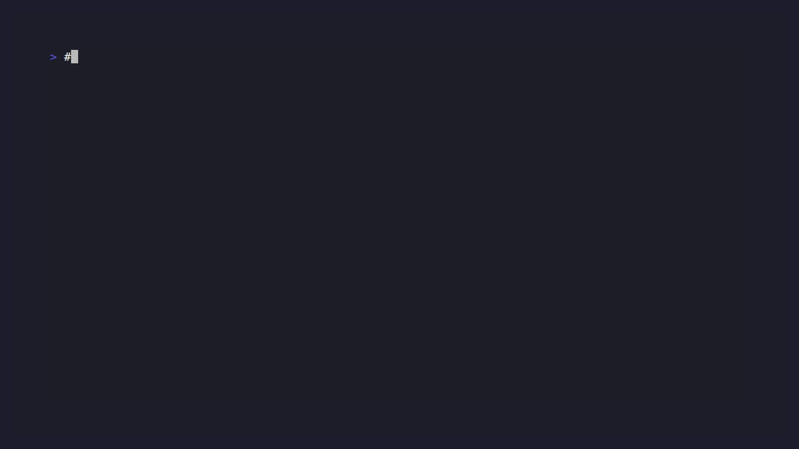

<div align="center">

# 🛡️ promptshield

**Drop-in security gateway for LLM APIs.** Block prompt injection, scrub PII, and stop secrets from leaking to OpenAI / Anthropic / Gemini — without changing a single line of your application code.

[](https://goreportcard.com/report/github.com/dokienlam/promptshield)
[](LICENSE)
[](https://go.dev)



</div>

---

## What is promptshield?

`promptshield` sits between your app and an LLM provider. It inspects every request, blocks or redacts dangerous content, and logs everything to a local SQLite file with a built-in dashboard.

```
   ┌──────────┐      ┌──────────────┐      ┌──────────────────┐
   │ your app │ ───▶ │ promptshield │ ───▶ │ openai/anthropic │
   └──────────┘      └──────┬───────┘      └──────────────────┘
                            │
                            ▼
                     ┌──────────────┐
                     │  dashboard   │
                     │  + sqlite    │
                     └──────────────┘
```

You point your SDK at `localhost:8080/openai/...` instead of `api.openai.com`, and that's it.

## Why?

- **Prompt injection is unsolved.** New jailbreaks appear weekly. You need a defense-in-depth layer that doesn't depend on remembering to wrap every call site.
- **PII goes to LLMs by accident.** A user pastes an email thread into a chat box, and now Acme Corp's customer data is in OpenAI's logs. `promptshield` redacts it before it leaves your network.
- **Secrets leak via prompts.** Devs paste API keys into Cursor, support staff paste customer tokens. `promptshield` catches them.
- **Existing libraries require code changes.** `LLM Guard`, `Rebuff`, `NeMo Guardrails` are Python libraries. They only protect the code paths you remember to wrap. A proxy protects everything.

## Features

- **Provider-agnostic** — works with OpenAI, Anthropic, and Google Gemini APIs
- **Zero code change** — just change your base URL
- **Three modes** — `block`, `redact`, or `observe`
- **Built-in detectors** — prompt injection, jailbreak attempts, PII (email/phone/SSN/credit card/IBAN), API key leakage (OpenAI/Anthropic/AWS/GitHub/Google/Slack/private keys)
- **Live dashboard** — top triggered rules, blocked requests, latency, cost
- **Single binary** — pure Go, no CGO, ~18 MB
- **SQLite logging** — auditable history, no external services
- **Streaming-compatible** — passes through SSE responses unchanged

## Quick start

### Docker

```bash
docker run -p 8080:8080 -p 8081:8081 ghcr.io/dokienlam/promptshield:latest
```

### Binary

```bash
go install github.com/dokienlam/promptshield@latest
promptshield --listen :8080 --dashboard :8081
```

### From source

```bash
git clone https://github.com/dokienlam/promptshield && cd promptshield
go build -o promptshield .
./promptshield
```

Open the dashboard at <http://localhost:8081>.

## Usage

### OpenAI SDK

```python
from openai import OpenAI

client = OpenAI(
    base_url="http://localhost:8080/openai/v1",  # ← only this changes
    api_key="sk-...",
)
client.chat.completions.create(
    model="gpt-4o",
    messages=[{"role": "user", "content": "Hello!"}],
)
```

### Anthropic SDK

```python
from anthropic import Anthropic

client = Anthropic(
    base_url="http://localhost:8080/anthropic",  # ← only this changes
    api_key="sk-ant-...",
)
```

### Direct curl

```bash
curl http://localhost:8080/openai/v1/chat/completions \
  -H "Authorization: Bearer $OPENAI_API_KEY" \
  -H "Content-Type: application/json" \
  -d '{"model":"gpt-4o","messages":[{"role":"user","content":"Hi"}]}'
```

## Modes

| Mode      | High-severity findings | Medium PII findings  | Low findings |
|-----------|------------------------|----------------------|--------------|
| `block`   | 403 Forbidden          | redacted, forwarded  | logged       |
| `redact`  | redacted, forwarded    | redacted, forwarded  | logged       |
| `observe` | logged, forwarded      | logged, forwarded    | logged       |

```bash
promptshield --mode block       # default — strict
promptshield --mode redact      # never block, just clean PII
promptshield --mode observe     # log everything, change nothing (great for canary)
```

## Detection rules

`promptshield` ships with a curated rule set. Run the test suite (`go test ./...`) to see them in action.

| Category         | Rules |
|------------------|-------|
| `prompt_injection` | `ignore_previous`, `override_system`, `persona_override`, `role_switch`, `developer_mode`, `end_of_prompt`, `new_instructions`, `output_directive`, `data_exfil`, `prompt_leak_attempt`, `instruction_marker` |
| `jailbreak`        | `dan`, `dan_alt`, `unfiltered`, `hypothetical_evil`, `refusal_bypass`, `grandma_exploit` |
| `pii`              | `email`, `us_phone`, `ssn`, `credit_card` (Luhn-validated), `ipv4`, `iban` |
| `secret`           | `openai_key`, `anthropic_key`, `aws_access_key`, `github_token`, `google_api_key`, `slack_token`, `private_key_block` |

## Comparison

|                          | promptshield | LLM Guard | Rebuff | NeMo Guardrails | Lakera Guard |
|--------------------------|:--:|:--:|:--:|:--:|:--:|
| Drop-in proxy (no code change) | ✅ | ❌ | ❌ | ❌ | ✅ |
| Open source              | ✅ | ✅ | ✅ | ✅ | ❌ |
| Single binary, no Python | ✅ | ❌ | ❌ | ❌ | ❌ |
| Multi-provider           | ✅ | partial | ❌ | ✅ | ✅ |
| Built-in dashboard       | ✅ | ❌ | ❌ | ❌ | ✅ |
| Self-hostable            | ✅ | ✅ | ✅ | ✅ | ❌ |

## Architecture

```
main.go         entry point, flag parsing, server lifecycle
proxy.go        reverse proxy + provider routing + redact/block logic
detector.go     pipeline interface + redaction helpers
injection.go    prompt-injection + jailbreak rules (regex-based)
pii.go          PII + secret detectors (regex + Luhn validation)
store.go        SQLite logging + aggregation queries
dashboard.go    embedded HTML/JS dashboard
```

Roughly 1k lines of Go. Single package, no framework.

## Roadmap

- [ ] LLM-based semantic injection detection (using a local small model)
- [ ] Rate limiting + per-API-key quotas
- [ ] OpenTelemetry export
- [ ] Token / cost accounting per project
- [ ] WASM plugins for custom detectors
- [ ] Streaming response inspection (currently pass-through)
- [ ] Helm chart

## Contributing

Pull requests welcome. Especially appreciated:

- New detection rules (with test cases)
- Bug reports with a reproducer
- Documentation improvements
- Translations of the dashboard

Open an issue first if it's a big change.

## License

MIT — see [LICENSE](LICENSE).

## Acknowledgments

Inspired by:
- [LiteLLM](https://github.com/BerriAI/litellm) — proved the proxy pattern works
- [LLM Guard](https://github.com/protectai/llm-guard) — detection rule taxonomy
- [Caddy](https://github.com/caddyserver/caddy) — single-binary distribution model

---

<div align="center">
If this saved you a security incident, give it a ⭐ — it really helps.
</div>
